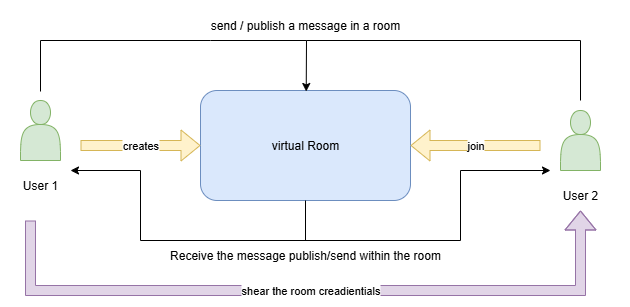
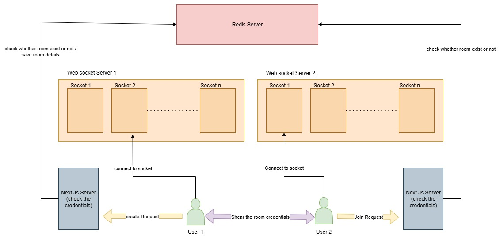
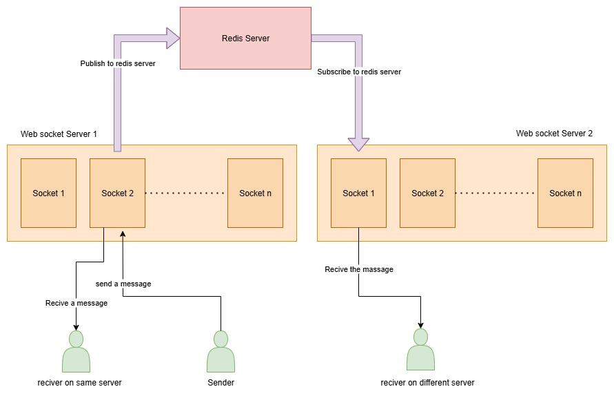

### **project title:** Vroom

### **project description:**

a chat application for smooth and secure communication between peoples without any need of personal contact info or login/signup option, while maintaining the complete privacy by removing all the data just after the communication get over

### **Requirements:** 

1. a landing page explain the complete project 
2. landing page mainly consists of 3 things:
    1. beginner friendly intro about the project
    2. create room option
    3. join room option
3. **Room:** A temporary virtual room for message shearing, people can join the room to start communicating with each other and once the chatting is done room gets terminated
4. people can join the room via link or system credentials
5. room must consists of:
    1. A chat interface
    2. A link to invite other for joining the room
    3. A button to terminate the room to end the communication

### **Specification:**

1. must not need any personal info or login/signUp to start communication 
2. must follow E2E encryption standard for message transfer 
3. room creation credentials must be taken form the user to create an illusion like we can create same room twice
4. once the room is terminated all the data related to the communication must get deleted to maintain privacy
5. room termination system must be automated in case user forget to terminate it manually
6. room get terminated once the user close the tab

### **Tech Stack:**

* **Next.JS : frontend and backend**
* **Socket.IO : websocket connection**
* **Express : for handling websocket connection**
* **redis : message Broker and for data storing**

### Workflow

**This diagram represents the workflow of real-time communication between multiple users using virtual rooms. Each room acts as a private space where messages are exchanged only between members of that specific room. The steps are as follows:**

1. **Room Creation**
    - A user (e.g., User 1) initiates the process by creating a virtual room.
    - This room is uniquely identified by a generated Room ID or credentials (such as a code or link).
    - The room acts as a private channel where only authorized users can exchange messages.
2. **Sharing Room Credentials**
    - After the room is created, the room credentials (Room ID / link) are shared with other participants (e.g., User 2).
    - This ensures that only users with valid credentials can join the room, maintaining privacy and security.
3. **Joining the Room**
    - Another user (e.g., User 2) can join the virtual room using the shared credentials.
    - Once joined, both users are part of the same communication channel.
4. **Sending / Publishing Messages**
    - Any user inside the virtual room can send or publish a message.
    - The message is delivered to the virtual room, which acts as a message broker or communication hub. 
5. **Receiving Messages**
    - All users currently present in the virtual room automatically receive the message published within that room.
    - This ensures real-time, synchronized communication between participants.
6. **Key Point**
    - Messages are isolated per room.
    - Users in different rooms cannot see or interfere with messages exchanged in other rooms.
    - This architecture is highly scalable for group chats, collaborative spaces, or private discussions.

### Websocket Architecture

**This diagram illustrates the distributed chat system architecture where multiple WebSocket servers handle real-time communication, while Redis ensures synchronization and message consistency across servers.**

1. **Room Creation (User 1)**
    - User 1 initiates a create request from the frontend.
    - The Next.js server checks the request and validates credentials.
    - The Next.js server then interacts with the Redis server to:
        - Verify if a room with the given ID already exists.
        - If not, store the room details (room ID, metadata, expiration time, etc.).
2. **Sharing Room Credentials**
    - Once the room is created, the room credentials (Room ID or link) are generated.
    - User 1 shares these credentials with User 2 (or other participants) outside the system.
3. **Room Joining (User 2)**
    - User 2 uses the shared credentials and sends a join request to the Next.js server.
    - The Next.js server again consults the Redis server to verify whether the room exists.
    - If valid, User 2 is allowed to connect to the room.
4. **Connecting to WebSocket Servers**
    - After validation, both User 1 and User 2 establish connections to the WebSocket servers.
    - Each WebSocket server manages multiple sockets (`Socket 1, Socket 2, …`).
    - Every connected socket can be treated as a virtual room of its own, because it maintains a persistent channel between the client and the server.
    - However, in this architecture, sockets are grouped under room IDs to enable multi-user communication inside a shared virtual room.
5. **Redis Role**
    - Redis serves as the room registry and state manager.
    - It is responsible for checking whether a room exists and storing metadata such as active users and room expiration.
    - Redis ensures that only valid rooms can be created or joined.
6. **Key points**
    - Each socket is essentially a virtual room, since it represents a dedicated communication channel.
    - For multi-user chat, sockets are grouped together under a shared room ID maintained in Redis.
    - Next.js handles validation, Redis handles room state, and WebSocket servers handle live user connections.

### Message Flow Architecture

**This diagram shows how a message sent from one client is delivered to receivers connected on the same server as well as different servers using Redis Pub/Sub.**

1. **Message Sending (Sender → WebSocket Server 1)**
    - A sender client connected to WebSocket Server 1 (via one socket) sends a message.
    - This message is first delivered locally within Server 1.
        - If the recipient is also connected to the same WebSocket server, the message is directly sent to that socket.
2. **Publishing to Redis**
    - To ensure the message reaches users connected on other WebSocket servers, Server 1 publishes the message to Redis.
    - Redis acts as a message broker in this architecture.
3. **Redis Pub/Sub Mechanism**
    - The Redis server receives the message from Server 1.
    - Redis broadcasts (publishes) this message to all WebSocket servers that are subscribed to this channel.
4. **Receiving on Another Server**
    - WebSocket Server 2, which is subscribed to Redis, receives the published message.
    - Server 2 checks which connected sockets belong to the intended room/user.
    - The message is then delivered to the receiver client connected on Server 2.
5. **Same Server vs Different Server**
    - Receiver on the same server (Server 1):\
The message flows directly from sender’s socket → receiver’s socket without Redis involvement.
    - Receiver on a different server (Server 2):\
The message flows like this:\
`Sender → WebSocket Server 1 → Redis Publish → Redis Subscribe → WebSocket Server 2 → Receiver`.
6. **Virtual Room Perspective**
    - Just like before, each socket can be seen as a virtual room because it maintains its own dedicated channel.
    - But to enable group communication, multiple sockets are mapped into rooms (channels).
    - Redis ensures these virtual rooms exist across multiple WebSocket servers, keeping everything in sync.
7. **Key Takeaway**
    - Redis acts as the bridge between multiple WebSocket servers, ensuring real-time message delivery across servers.
    - Local messages stay inside the same WebSocket server, while cross-server messages go through Redis.
    - This makes the system scalable — you can add more WebSocket servers without breaking communication.

